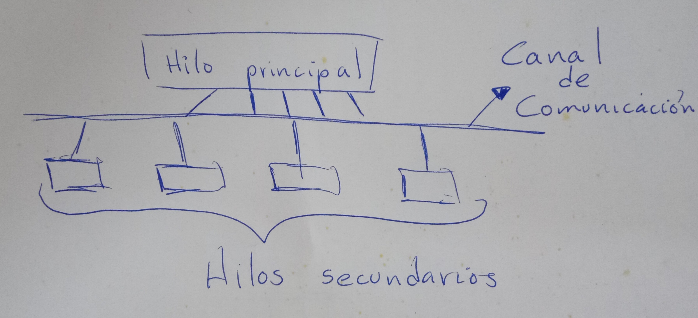
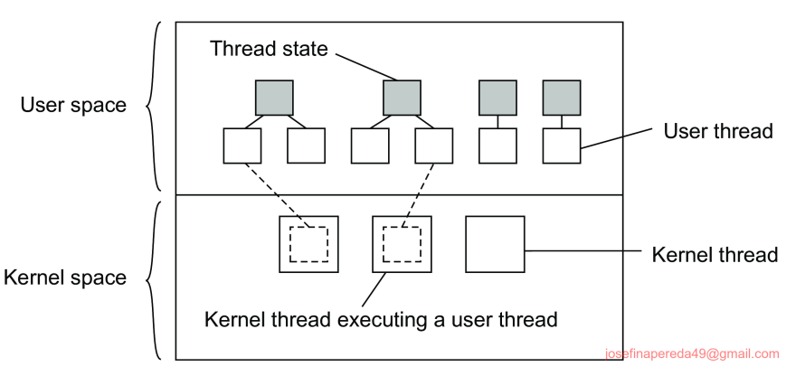

# Reporte

Dada la propia naturaleza distribuida de BitTorrent, describiremos, a continuación, cada uno de los componentes con respecto a los detalles intrínsecos de BitTorrent (cliente BitTorrent) y los detalles de distribución del Tracker.

## 1. Arquitectura

### 1.1 Cliente BitTorrent

Un cliente de BitTorrent mantiene interacciones (conexiones) con un número de procesos (otros clientes) que puede crecer o disminuir a medida que estos se unen o se van; de ahí la importancia de tener una arquitectura en la que exista una fuerte separación entre procesamiento y coordinación. Con este objetivo en mente, nos apoyamos en el estilo **Publish-Subscribe**, donde la idea es ver al sistema (el propio cliente) como una colección de procesos (hilos) que operan de manera **autónoma**. En este modelo, la coordinación contempla comunicación y la cooperación entre procesos.

Para materializar Publish-Subscribe diseñamos un hilo principal de procesamiento, y múltiples hilos que mantienen la interacción con los clientes en la vecindad. La comunicación solo se produce entre los hilos asociados a clientes (hilos secundarios) con el hilo de procesamiento principal, a través de un canal de comunicación (valga la redundancia), donde los hilos secundarios publican notificaciones que serán recibidas por el hilo principal, actuando en consecuencia. Notemos como este formato se ajusta a la propia naturaleza de BitTorrent y desacopla por completo el procesamiento de la interacción, permitiendo escalar con un número arbitrario de vecinos.

Se usará Chord, que es una implementación de una distributed hash table: de esta forma a cada usuario le será asignado un nodo de Chord, y por consiguiente, este constituirá la forma de comunicarse con el sistema, en nuestro caso solamente es: encontrar otros usuarios (peers o seeders) que deseen compartir el mismo archivo.

### 1.2 Arquitectura Distribuida

En BitTorrent, los usuarios deben establecer una conexión P2P con los mismos usuarios que desean descargar o subir un archivo en común. Los usuarios deben comunicarse con un responsable que les indique quienes son los otros usuarios a los que deben conectarse. Esta función la realiza en el modelo original un servidor denominado tracker.

Para evitar que toda la red dependa de un servidor realizando la función de tracker, una alternativa, es distribuir la información que contiene el tracker, entre los mismos usuarios del sistema, formando una red distribuida, en la que cada usuario contiene un subconjunto de la información que el tracker era previamente responsable. Garantizando que la unión de todos los subconjuntos equivalga a la información original. 

DHT se encarga de determinar en que nodo se debe guardar un dato en específico, usando un hash de este como identificador. Están entonces, los datos ubicados a lo largo de todos los nodos que integran la DHT.

Para llegar a un recurso, la DHT se encarga: realiza un hash de este, obteniendo un número de $m$ bits, con este determina cuál es el nodo responsable de guardar este dato si existiese. Sabiendo esto, lo que queda es que encontrar una forma de desde el nodo actual comunicarse con el nodo que guarda ese dato en específico.

Es ventajoso usar una DHT, pues en el contexto de BitTorrent, lo necesario es guardar los usuarios que están pendiente de un archivo $X$, no hay problema porque dos nodos diferentes tengan dos diferentes listas sobre quienes desean ese archivo. Lo que si es necesario que sea consistente es que las direcciones de los usuarios contenidos en esas listas sean consistentes, o estén actualizadas.

El objetivo de la red de Docker es simular un entorno donde hay varios usuarios en diferentes redes, y comprobar el funcionamiento distribuido de la DHT. En nuestro caso no hay necesidad de tener servicios separados en redes de Docker, ya que todos los usuarios poseen las mismas responsabilidades. Es posible añadir un tracker centralizado, o usuarios en diferentes redes.

## 2. Procesos

### 2.1 Cliente BitTorrent

Cada cliente BitTorrent representa un único proceso, formado por múltiples hilos (descritos anteriormente). 

Decidimos utilizar Go para implementar los clientes, dado que las goroutines (hilos en Go) implementan un modelo many-to-many de threading, donde combinan el uso de user-threads y kernel-threads (muchos kernel-threads por proceso y muchos user-threads por kernel-thread, estos últimos a su vez manejados por un user-level thread package), lo que:

- Permite que crear, destruir y sincronizar hilos sea relativamente barato y no involucre la intervención del kernel en absoluto
- Permite que un blocking system-call no suspenda al proceso por completo
- Permite que la interacción con los hilos a nivel de aplicación sea totalmente transparente, el programador no se entera de la existencia de los kernel-threads
- Permite que los kernel-threads sean utilizados en entornos de multiprocesamiento (a diferencia de los hilos en Python) al ejecutarlos en CPUs/cores distintos; de nuevo, de una manera totalmente transparente

**Nota**: Imagen extraída de: *M. van Steen and A.S. Tanenbaum, Distributed Systems, 4th ed., distributed-systems.net, 2023*

## 3. Comunicación

### 3.1 Cliente BitTorrent

Para la comunicación entre clientes, utilizamos directamente la **interfaz de socket** (sobre TCP) ofrecida por el lenguaje de programación. A su vez, con el objetivo de abstraer los detalles relacionados con la interpretación y manejo de los bits enviados/recibidos, definimos una interfaz **Messenger**.

Notemos que al utilizar los sockets puros solo podemos disponer de una comunicación one-to-one entre clientes; esto, por supuesto, lo tuvimos en cuenta a la hora de realizar el diseño, sin embargo, no descartamos el uso de patrones de mensajería como **ZeroMQ** (permite comunicaciones one-to-many y many-to-many) en un futuro para refactorizar y quizás optimizar el funcionamiento de cada cliente.

## 4. Coordinación

### 4.1 Cliente BitTorrent

Como mencionamos anteriormente (sección de arquitectura), los hilos que conforman al cliente están desacoplados referencialmente, sin embargo, están acoplados temporalmente (todos se encuentran en funcionamiento), esto da lugar a una **coordinación basada en eventos** (event-based coordination). En sistemas desacoplados referencialmente los procesos (hilos) no conocen de la existencia de otros de manera explícita, lo único que pueden hacer es publicar la notificación describiendo la ocurrencia de un evento.

De nuevo, Go facilita mucho la implementación de este diseño al proveer los **canales** (channels) que actúan como bus para que los hilos secundarios publiquen sus notificaciones y el hilo principal pueda recibirlas y procesarlas. Es importante destacar que para un flujo eficiente, el procesamiento realizado por el hilo principal debe estar constituido solo por una cantidad constante de operaciones en CPU, cualquier otra operación cuya duración sea dependiente de la entrada y/o de otro proceso/hilo debe convertirse en un hilo secundario.

### 4.2 Distribuido

La comunicación entre los nodos de la DHT se realiza a través de sockets. Para un nuevo nodo unirse a la DHT es necesario que sepa de la localización de otro nodo ya en la DHT. 

## 6. Consistencia y Replicación

Respecto a la consistencia o replicación: replicar los datos no trae consigo ningún problema, pues los usuarios solamente necesitan saber como localizar a los usuarios con su mismo objetivo (un archivo en específico, por ejemplo), sin embargo, si es necesario garantizar que sean consistentes: 

La validez de la localización de un usuario se reduce a que IP, puerto está usando, algún cambio en estos hace que la información contenida en otros nodos no sea válida. Dado esta situación una posible solución es cada cierto tiempo comprobar la consistencia de los datos, (por ejemplo haciendo ping para comprobar que cierto <ip, port> está activo todavía). Esta verificación puede ser usada también para actualizar un nodo cuyo vecino se haya marchado, caído temporalmente, etc.